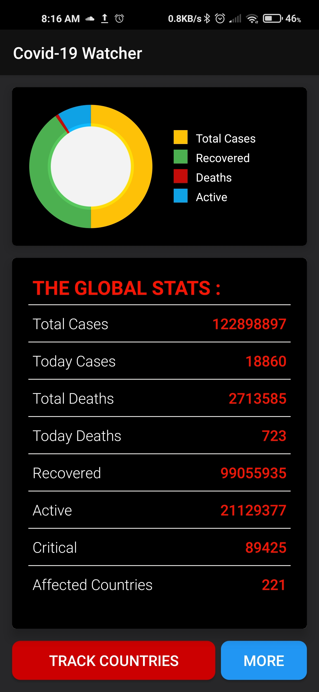
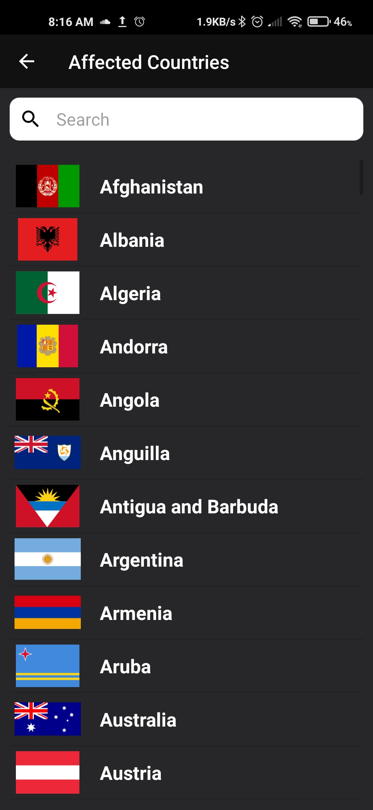
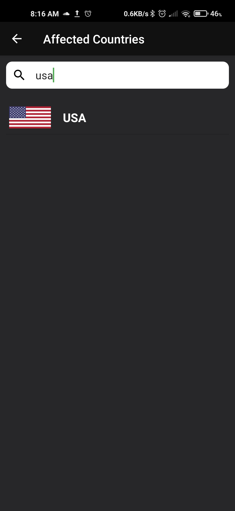
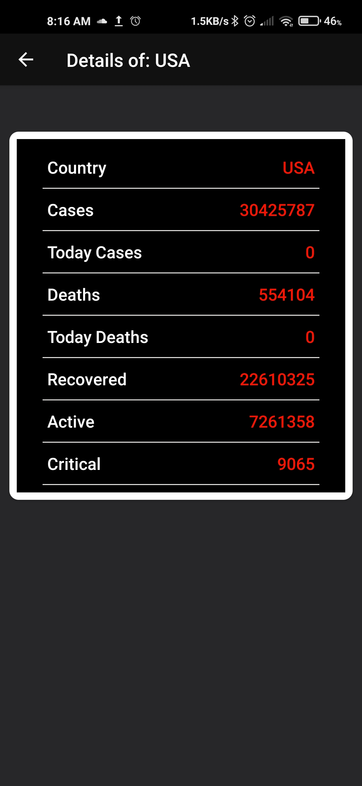
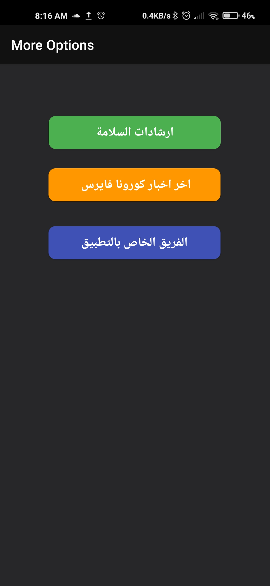
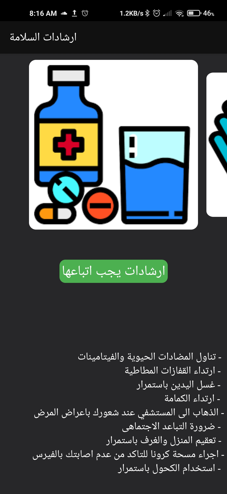

# Ui 
,
,
,
,
,
,
,

# description
Covid-19 Tracker is a Simple app that watch and track corona virus state in the whole world and in countries , app depend on web service & API to show the data .

# API
https://corona.lmao.ninja/
# Simple Loader
https://github.com/generic-leo/SimpleArcLoader
# piechart graph
https://github.com/blackfizz/EazeGraph
# volley library
https://developer.android.com/training/volley
# glide Library
https://github.com/bumptech/glide

